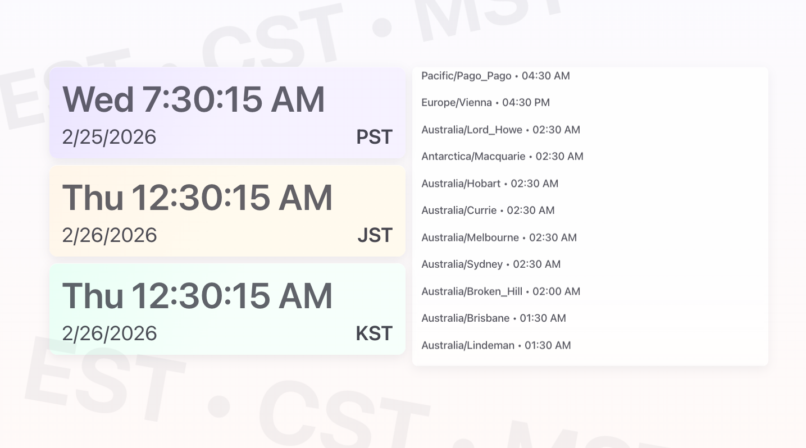

# BasicClock

A beautiful, minimal multi-timezone clock display with a soft pastel color palette and smooth animations.



## Features

- **Main Timezone Display**: Three large, prominent clock cards showing time, date, and timezone label (customize in `jsBox.js`)
- **Scrolling Timezone List**: Live, continuously scrolling list of all timezones with real-time updates on the right side
- **Soft Pastel Design**: Gentle color palette with gradient backgrounds for each main card
- **Live Updates**: All times update every second
- **Responsive Layout**: 50/50 left-right split adapts to different screen sizes
- **Minimal Animations**: Floating card effects and smooth scroll animations

## How to Use

1. Open `index.html` directly in a web browser (no server required)
2. The three main timezones display on the left: **PST** (Los Angeles), **JST** (Tokyo), **KST** (Seoul)
3. All world timezones scroll continuously on the right with live times

## Customization

### Change the Main Three Timezones

Edit the `tzString` constant in `jsBox.js`:

```javascript
const tzString = "America/Los_Angeles:PST,Asia/Tokyo:JST,Asia/Seoul:KST";
```

Format: `TimezoneName:Label,TimezoneName:Label,...`

Example: `"Europe/London:GMT,America/New_York:EST,Asia/Shanghai:CST"`

### Adjust Styling

All CSS is in `cssBox.css`. Key variables:
- `--accent-text`: Primary text color (default: soft gray)
- `--card-radius`: Card border radius (default: 14px)

Modify font sizes, colors, animation speeds, or layout dimensions as needed.

## Files

- `index.html` — Main HTML structure
- `jsBox.js` — Core JavaScript logic (layout, time updates, scrolling list)
- `cssBox.css` — All styling, animations, and responsive design
- `timezoneList.js` — Complete list of valid IANA timezones
- `README.md` — This file

## Browser Support

Works in all modern browsers (Chrome, Firefox, Safari, Edge). Uses vanilla JavaScript with no dependencies.
